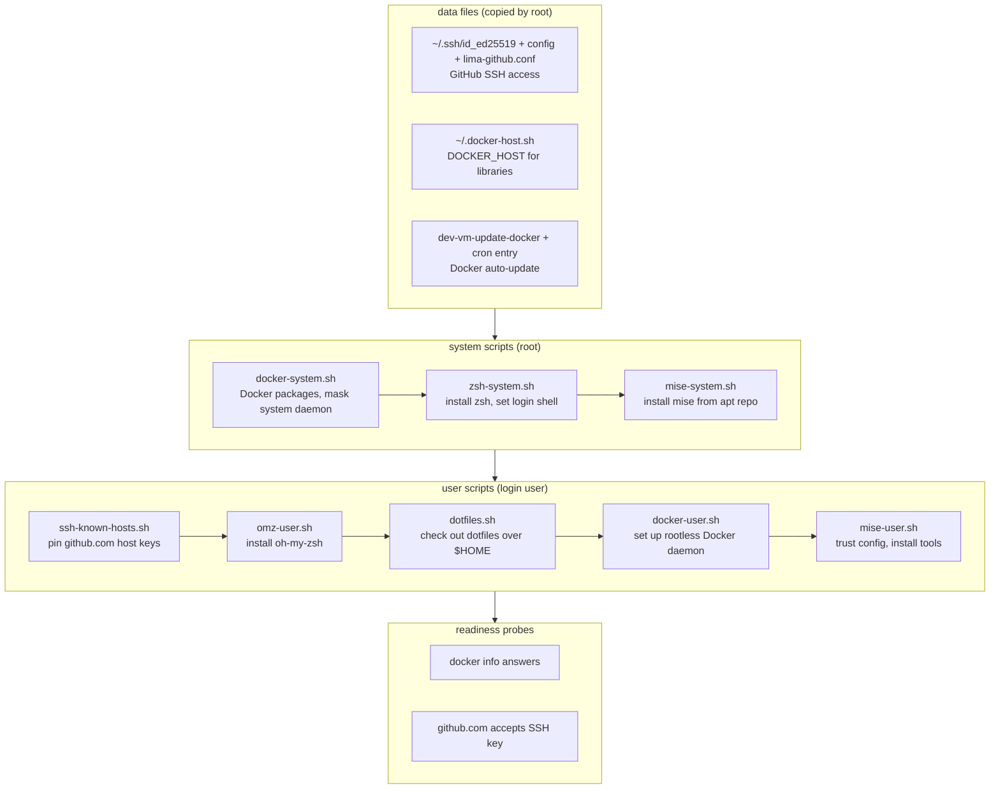

# dev-vm

Isolated Lima dev VM for macOS: own IP via vzNAT, no mounts, no port
forwards, rootless Docker, zsh + oh-my-zsh, mise, GitHub SSH access.

```sh
go run . create [name]    # create and start the VM
go run . destroy [name]   # delete it
go run . list             # list VMs with status and SSH hostname
limactl shell <name>      # open a shell inside
```

See [CLAUDE.md](CLAUDE.md) for how Lima provisioning works in detail.

## Requirements

- macOS with [Lima](https://lima-vm.io) 2.0.0+ (`limactl`).
- [GitHub CLI](https://cli.github.com) (`gh`), logged in with the
  `admin:public_key` scope: `gh auth refresh -h github.com -s admin:public_key`.
- Go, to run the CLI with `go run .`.

## Usage

1. Create the VM (name defaults to `default`):

   ```sh
   go run . create myvm
   ```

   This generates an SSH key, registers it on GitHub, boots the VM
   (4 CPUs, 16 GiB RAM, 50 GiB disk) and runs provisioning.

2. Optional — bring your dotfiles (bare repo checked out over `$HOME`):

   ```sh
   go run . create myvm --dotfiles=git@github.com:user/dotfiles.git
   ```

   Put `{"dotfiles": "<repo>"}` in `~/.config/dev-vm/settings.json` to enable
   it for every VM; `--no-dotfiles` skips it.

3. Get in:

   ```sh
   limactl shell myvm
   # or, with the hostname from the SSH column of `go run . list`:
   ssh -F ~/.lima/myvm/ssh.config lima-myvm
   ```

4. Check what exists — name, Lima status, SSH hostname:

   ```sh
   go run . list
   ```

5. Throw it away (deletes the VM, the GitHub key and the local key pair):

   ```sh
   go run . destroy myvm
   ```

State lives in `~/.config/dev-vm/state.json`, keys in
`~/.config/dev-vm/keys/`.

## GitHub SSH key

`create` generates a fresh ed25519 key pair on every run — never a key from
`~/.ssh` — and registers the public key on GitHub (title = VM name), replacing
any previous key with the same title. `--create-ssh-key=no` reuses the pair
from an earlier create.

- Host: `~/.config/dev-vm/keys/<name>` (dir 0700, private key 0600, enforced
  on every create). The host's `~/.ssh` is never read; Lima does not load
  `~/.ssh/*.pub` into the guest.
- Guest: the private key is uploaded to `~/.ssh/id_ed25519`; `~/.ssh/config`
  pins it for github.com with `IdentitiesOnly yes`.
- `destroy` deletes the GitHub key, the local pair, and the state entry.

## Provisioning steps

Every step runs on **each boot** (all scripts are idempotent). The template
is flattened at create time, so after editing `lima/dev-vm.yaml` or
`lima/scripts/*.sh` the VM must be recreated.

Order: data files, then system scripts (root), then user scripts (guest login
user), then readiness probes gate `limactl start`.

1. **Data files** — GitHub key + ssh config, the `DOCKER_HOST` snippet, the
   Docker updater and its cron entry.
2. **`docker-system.sh`** — installs Docker Engine from Docker's apt repo
   (with `docker-ce-rootless-extras`), then masks the system-wide
   `docker`/`containerd` units so only the rootless daemon exists.
3. **`zsh-system.sh`** — installs zsh + git, `chsh` the guest user to zsh.
4. **`mise-system.sh`** — installs mise from its apt repo.
5. **`ssh-known-hosts.sh`** — rewrites `~/.ssh/known_hosts` from live
   `ssh-keyscan github.com` output.
6. **`omz-user.sh`** — installs oh-my-zsh (skipped if `~/.oh-my-zsh` exists).
7. **`dotfiles.sh`** — clones the bare repo to `~/.dotfiles`, checks it out
   over `$HOME` (clobbered files move to `~/tmp/config-backup`), and prepends
   the GitHub ssh stanza back onto `~/.ssh/config`. No-op without
   `DOTFILES_REPO`.
8. **`docker-user.sh`** — `dockerd-rootless-setuptool.sh install`, selects the
   `rootless` context, sources `~/.docker-host.sh` from `~/.bashrc`.
9. **`mise-user.sh`** — activates mise in `~/.zshrc` (unless the oh-my-zsh
   mise plugin already does), `mise trust --all`, `mise install`.


