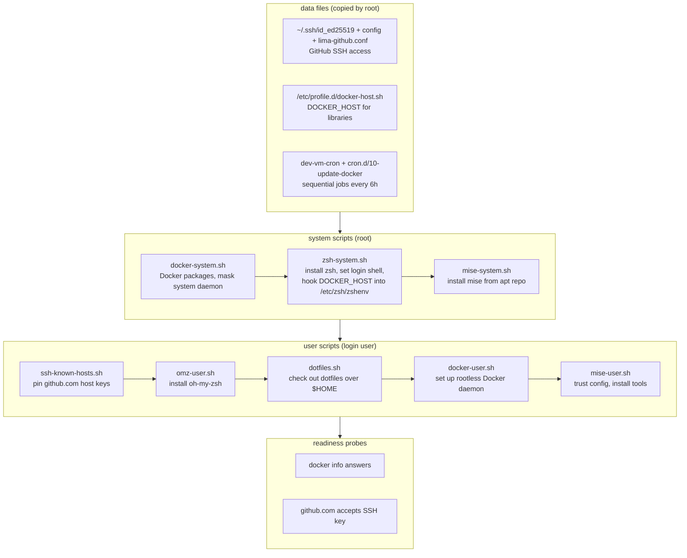

# dev-vm

Isolated Lima dev VM for macOS: own IP via vzNAT, no mounts, no port
forwards, rootless Docker, zsh + oh-my-zsh, mise, GitHub SSH access.

```sh
go run . create [name]    # create and start the VM
go run . start [name]     # boot a stopped VM
go run . stop [name]      # shut it down, keeping the disk
go run . destroy [name]   # delete it (confirms first; -force skips)
go run . list             # list VMs with status, size and SSH hostname
go run . completion zsh   # print the shell completion script
go run . version          # print the build version
limactl shell <name>      # open a shell inside
```

See [CLAUDE.md](CLAUDE.md) for how Lima provisioning works in detail.

## Requirements

- macOS with [Lima](https://lima-vm.io) 2.0.0+ (`limactl`).
- [GitHub CLI](https://cli.github.com) (`gh`), logged in with the
  `admin:public_key` scope: `gh auth refresh -h github.com -s admin:public_key`.
- Go, to run the CLI with `go run .` (not needed for a released binary).

## Install

### Homebrew

The formula lives in the
[robsonpeixoto/homebrew-tap](https://github.com/robsonpeixoto/homebrew-tap)
tap (`Formula/dev-vm.rb` there):

```sh
brew tap robsonpeixoto/tap
brew install robsonpeixoto/tap/dev-vm
```

Later: `brew update && brew upgrade dev-vm`.

The tap is public, but this repo's release assets are private, so the formula
fetches them through the GitHub API with a custom download strategy.
Credentials come from `HOMEBREW_GITHUB_API_TOKEN`, the `gh` CLI login, or the
macOS keychain, in that order — a logged-in `gh` is enough.

### From a release

Prebuilt binaries are attached to every [release](../../releases). The repo is
private, so downloads need an authenticated `gh`:

```sh
gh release download v0.3.1 -p 'dev-vm_*_darwin_arm64.tar.gz'
tar xzf dev-vm_0.3.1_darwin_arm64.tar.gz
install dev-vm_0.3.1_darwin_arm64/dev-vm /usr/local/bin/dev-vm
```

The binaries are unsigned, so macOS quarantines them on first run — clear it
with `xattr -d com.apple.quarantine /usr/local/bin/dev-vm`.

`linux/{amd64,arm64}` builds are published too, but the tool drives Lima with
`vz`/`vzNAT` (Apple Virtualization.framework) and only works on macOS.

Everything the VM needs is embedded in the binary; there are no data files to
ship alongside it. Verify a download against `checksums.txt` from the same
release.

## Usage

1. Create the VM (name defaults to `default`):

   ```sh
   go run . create myvm
   ```

   This generates an SSH key, registers it on GitHub, boots the VM
   (2 vCPUs, 2 GiB RAM, 50 GiB disk) and runs provisioning.

2. Optional — bring your dotfiles (bare repo checked out over `$HOME`):

   ```sh
   go run . create myvm -dotfiles git@github.com:user/dotfiles.git
   ```

   Put `{"dotfiles": "<repo>"}` in `~/.config/dev-vm/settings.json` to enable
   it for every VM; `-no-dotfiles` skips it.

3. Optional — size the VM. `-memory` and `-disk` are plain integers in GiB:

   ```sh
   go run . create myvm -cpus 8 -memory 16 -disk 100
   ```

   The same keys work in `~/.config/dev-vm/settings.json` as machine-wide
   defaults, next to `dotfiles`:

   ```json
   {
     "dotfiles": "git@github.com:user/dotfiles.git",
     "cpus": 4,
     "memory": 8,
     "disk": 100
   }
   ```

   A flag beats settings.json, which beats the built-in defaults. Size is
   baked into the instance at create time, so changing it means
   `go run . destroy myvm && go run . create myvm -cpus …`.

4. Get in:

   ```sh
   limactl shell myvm
   # or, with the hostname from the SSH column of `go run . list`:
   ssh -F ~/.lima/myvm/ssh.config lima-myvm
   ```

5. Check what exists — name, Lima status, size, SSH hostname:

   ```sh
   go run . list
   ```

6. Stop and start it. A host reboot leaves every VM stopped; `start` boots it
   again, re-running provisioning and the readiness probes:

   ```sh
   go run . stop myvm
   go run . start myvm
   ```

   `stop -force` kills the VM instead of shutting the guest down gracefully —
   faster, but unwritten guest data is lost.

7. Throw it away (deletes the VM, the GitHub key and the local key pair). It
   asks first — type the VM name back to go ahead, anything else aborts:

   ```sh
   go run . destroy myvm
   ```

   Scripts and CI pass `-force` to skip the prompt. Without a terminal on
   stdin, `destroy` refuses instead of hanging, so `-force` is mandatory
   there:

   ```sh
   go run . destroy myvm -force
   ```

State lives in `~/.config/dev-vm/state.json`, keys in
`~/.config/dev-vm/keys/`.

## Shell completion

`dev-vm completion <bash|zsh|fish>` prints the completion script for that
shell. It completes subcommands, the `create`, `stop` and `destroy` flags, and
the recorded VM names for `start`, `stop` and `destroy`.

Try it in the current shell:

```sh
source <(dev-vm completion bash)
source <(dev-vm completion zsh)
dev-vm completion fish | source
```

Homebrew installs the three scripts for you, so `brew install dev-vm` needs no
extra step. Otherwise install one permanently:

```sh
dev-vm completion bash > /usr/local/etc/bash_completion.d/dev-vm
dev-vm completion zsh > "${fpath[1]}/_dev-vm"
dev-vm completion fish > ~/.config/fish/completions/dev-vm.fish
```

The release tarballs also carry the scripts in `completions/`.

The zsh script needs `compinit` to have run first. Names come from the hidden
`dev-vm __names` command, which prints the VMs in the state file.

## Releasing

`.github/workflows/ci.yml` runs `gofmt`, `go vet`, `go build` and `go test` on
every push to `main` and every pull request.

Pushing a `v*` tag runs `.github/workflows/release.yml`, which cross-compiles
`linux/{amd64,arm64}` and `darwin/{amd64,arm64}`, injects the tag into
`main.version` with `-ldflags -X`, and publishes the four tarballs (each with
`README.md` and `completions/`) plus `checksums.txt` on a GitHub Release with
generated notes:

```sh
git tag -a v0.3.1 -m v0.3.1
git push origin v0.3.1
```

A last job checks out
[robsonpeixoto/homebrew-tap](https://github.com/robsonpeixoto/homebrew-tap),
bumps `version` and the four `sha256` values in its `Formula/dev-vm.rb` from
`checksums.txt`, and pushes, so the tap serves the new release without manual
editing. Two requirements:

- The repository secret `HOMEBREW_TAP_TOKEN` must hold a PAT with
  `contents: write` on the tap repo — `github.token` only reaches this
  repository.
- Each `sha256` line must stay two lines below its `url` line in the formula;
  the job fails loudly otherwise.

## GitHub SSH key

`create` generates a fresh ed25519 key pair on every run — never a key from
`~/.ssh` — and registers the public key on GitHub with the title
`dev-vm/<host>/<name>`, replacing any previous key with the same title.
`-create-ssh-key=false` reuses the pair from an earlier create.

`<host>` is the short host name from `os.Hostname()` (no `.local` suffix), so
two machines that both create `default` register two distinct keys instead of
deleting each other's. The exact title is recorded as `github_key_title` in the
state file; `destroy` deletes by that stored title, falling back to the bare VM
name for VMs created before titles were qualified.

- Host: `~/.config/dev-vm/keys/<name>` (dir 0700, private key 0600, enforced
  on every create). The host's `~/.ssh` is never read; Lima does not load
  `~/.ssh/*.pub` into the guest.
- Guest: the private key is uploaded to `~/.ssh/id_ed25519`; `~/.ssh/config`
  pins it for github.com with `IdentitiesOnly yes`.
- `destroy` deletes the GitHub key, the local pair, and the state entry,
  after confirming the VM name (`-force` skips the prompt).

## Provisioning steps

Every step runs on **each boot** (all scripts are idempotent). The template
is flattened at create time, so after editing `lima/dev-vm.yaml` or
`lima/scripts/*.sh` the VM must be recreated.

Order: data files, then system scripts (root), then user scripts (guest login
user), then readiness probes gate `limactl start`.

1. **Data files** — GitHub key + ssh config, the global `DOCKER_HOST` snippet
   (`/etc/profile.d/docker-host.sh`), and the maintenance cron: the runner
   `/usr/local/sbin/dev-vm-cron`, the Docker updater
   `/usr/local/lib/dev-vm/cron.d/10-update-docker`, and `/etc/cron.d/dev-vm`,
   whose single entry runs the runner every 6 hours (not at boot — provisioning
   installs the latest Docker packages on each boot anyway). The runner
   executes `/usr/local/lib/dev-vm/cron.d/*` in name order under `flock`, so
   jobs never run in parallel or fight for the dpkg lock.
2. **`docker-system.sh`** — installs Docker Engine from Docker's apt repo
   (with `docker-ce-rootless-extras`), then masks the system-wide
   `docker`/`containerd` units so only the rootless daemon exists.
3. **`zsh-system.sh`** — installs zsh + git, `chsh` the guest user to zsh, and
   sources `/etc/profile.d/docker-host.sh` from `/etc/zsh/zshenv` so
   non-login zsh (`limactl shell <name> <cmd>`) also gets `DOCKER_HOST`.
4. **`mise-system.sh`** — installs mise from its apt repo.
5. **`ssh-known-hosts.sh`** — rewrites `~/.ssh/known_hosts` from live
   `ssh-keyscan github.com` output.
6. **`omz-user.sh`** — installs oh-my-zsh (skipped if `~/.oh-my-zsh` exists).
7. **`dotfiles.sh`** — clones the bare repo to `~/.dotfiles`, checks it out
   over `$HOME` (clobbered files move to `~/tmp/config-backup`), and prepends
   the GitHub ssh stanza back onto `~/.ssh/config`. No-op without
   `DOTFILES_REPO`.
8. **`docker-user.sh`** — `dockerd-rootless-setuptool.sh install`, selects the
   `rootless` context.
9. **`mise-user.sh`** — activates mise in `~/.zshrc` (unless the oh-my-zsh
   mise plugin already does), `mise trust --all`, `mise install`.


