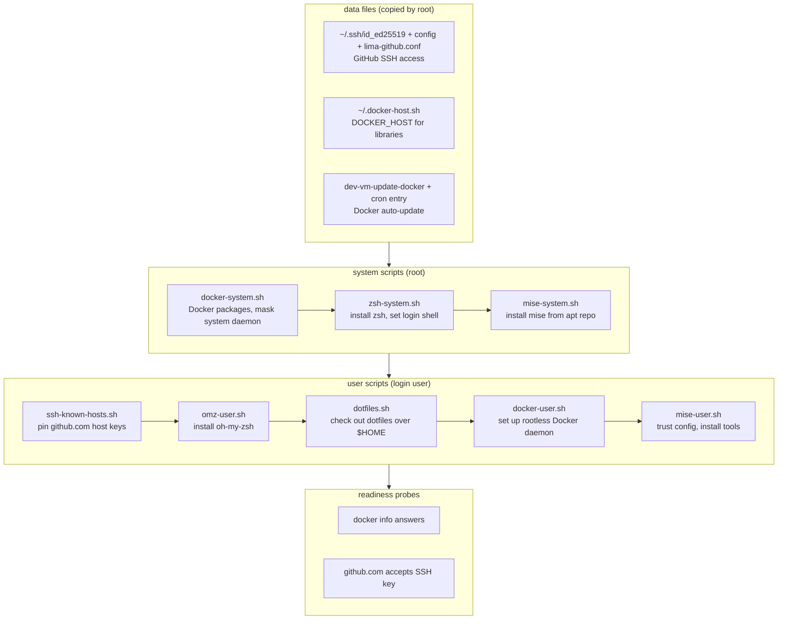

# dev-vm

Isolated Lima dev VM for macOS: own IP via vzNAT, no mounts, no port
forwards, rootless Docker, zsh + oh-my-zsh, mise, GitHub SSH access.

```sh
go run . create [name]    # create and start the VM
go run . destroy [name]   # delete it
limactl shell <name>      # open a shell inside
```

See [CLAUDE.md](CLAUDE.md) for how Lima provisioning works in detail.

## Provisioning steps

Every step runs on **each boot** (all scripts are idempotent). The template
is flattened at create time, so after editing `lima/dev-vm.yaml` or
`lima/scripts/*.sh` the VM must be recreated.


